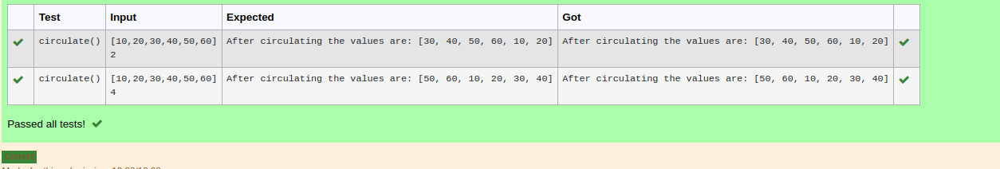

# Circulate-the-values-of-N-variables
## Aim:
To write a python program to circulate the n variables using function concept
## Equipment’s required:
PC
Anaconda - Python 3.7
## Algorithm: 
### Step 1: 
import numpy
### Step 2: 
get the input
### Step 3: 
Get the value from the user for the number of rotation
### Step 4: 
Using the slicing concept rotate the list
### Step 5: 
print the reult
### Step 6: 
end the program
## Program:
```python
#Program to circulate N values.
#Developed by: vinushcv
#RegisterNumber:22001897
def circulate():
    num1=[10,20,30,40,50,60]
    n=int(input())
    cir=num1[n:]+num1[:n]
    print("After circulating the values are:",cir)
    return
```


## Output:


## Result:
Thus a python program to circulate the n variables using function concept is succesfully executed
